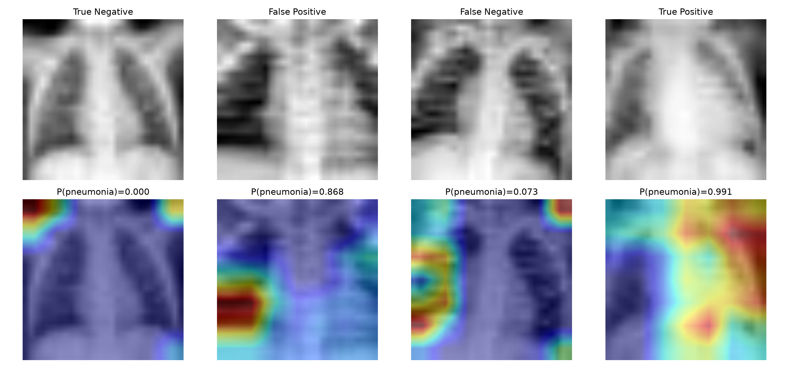

# Chest X-ray Pneumonia Classification

基于PneumoniaMNIST胸部X光数据集的肺炎二分类项目。项目实现了Simple CNN基线模型、类别不平衡处理、分类阈值优化、ResNet18迁移学习和Grad-CAM可解释性分析。

## 1. 项目目标

本项目旨在完成一个完整的医学影像分类流程：

1. 下载并分析胸部X光数据集；
2. 训练Simple CNN基线模型；
3. 使用Accuracy、Precision、Recall、F1和ROC-AUC评价模型；
4. 通过类别加权处理数据不平衡；
5. 在验证集上优化分类阈值；
6. 使用预训练ResNet18进行迁移学习；
7. 对ResNet18最后一个残差阶段进行微调；
8. 使用Grad-CAM分析模型关注区域。

本项目仅用于学习和研究，不能用于临床诊断。

## 2. 数据集

项目使用MedMNIST中的PneumoniaMNIST。

PneumoniaMNIST来源于儿童胸部X光数据，任务是区分：

- `0`：Normal
- `1`：Pneumonia

数据集划分如下：

| 数据集 | Normal | Pneumonia | 总数 |
|---|---:|---:|---:|
| 训练集 | 1214 | 3494 | 4708 |
| 验证集 | 135 | 389 | 524 |
| 测试集 | 234 | 390 | 624 |

训练集中肺炎样本约占74.2%，存在类别不平衡。因此训练时使用加权交叉熵，使数量较少的正常类别获得更高损失权重。

数据集官方网站：[MedMNIST](https://medmnist.com/)

## 3. 项目结构

```text
pneumonia-classification/
├── checkpoints/                 # 训练后的模型参数
├── data/                        # 自动下载的数据集
├── results/                     # 指标、混淆矩阵和Grad-CAM
├── src/
│   ├── data_exploration.py
│   ├── data_loader.py
│   ├── model.py
│   ├── train_baseline.py
│   ├── evaluate_baseline.py
│   ├── optimize_threshold.py
│   ├── resnet_data_loader.py
│   ├── resnet_model.py
│   ├── train_resnet.py
│   ├── finetune_resnet.py
│   ├── evaluate_resnet.py
│   └── gradcam_resnet.py
├── requirements.txt
└── README.md
```

## 4. 方法

### 4.1 Simple CNN

基线模型包含：

- 两个卷积层；
- ReLU激活函数；
- 两个最大池化层；
- 一个128维全连接层；
- Dropout；
- 二分类输出层。

模型共有205,890个可训练参数。

### 4.2 类别不平衡处理

训练集类别数量为：

```text
Normal: 1214
Pneumonia: 3494
```

加权交叉熵对应权重为：

```text
Normal: 1.9390
Pneumonia: 0.6737
```

正常样本数量较少，因此错误判断正常样本会产生更高损失。

### 4.3 阈值优化

默认分类阈值为0.5。本项目只在验证集上选择阈值，选择规则为：

> 在肺炎召回率不低于95%的条件下，最大化正常类别识别率。

Simple CNN最终阈值为0.63，ResNet18最终阈值为0.165。

测试集不参与阈值选择，避免数据泄漏。

### 4.4 ResNet18迁移学习

ResNet18使用ImageNet预训练权重。

训练分为两个阶段：

1. 冻结卷积主干，只训练新的二分类层；
2. 解冻`layer4`，使用较小学习率进行微调。

输入图像从单通道28×28转换为三通道224×224，并进行轻量旋转和平移增强。

## 5. 实验结果

### 5.1 Simple CNN

验证集最佳结果：

| Accuracy | Precision | Recall | F1 | ROC-AUC |
|---:|---:|---:|---:|---:|
| 0.9695 | 0.9844 | 0.9743 | 0.9793 | 0.9946 |

测试集默认阈值0.5：

| Accuracy | Precision | Recall | Specificity | F1 | ROC-AUC |
|---:|---:|---:|---:|---:|---:|
| 0.8750 | 0.8436 | 0.9821 | 0.6966 | 0.9076 | 0.9352 |

测试集优化阈值0.63：

| Accuracy | Precision | Recall | Specificity | F1 | ROC-AUC |
|---:|---:|---:|---:|---:|---:|
| 0.8862 | 0.8600 | 0.9769 | 0.7350 | 0.9148 | 0.9352 |

### 5.2 ResNet18

仅训练分类头时，最佳验证集AUC为0.9530。

解冻`layer4`进行微调后，最佳验证集AUC提高至0.9917。

测试集默认阈值0.5：

| Accuracy | Precision | Recall | Specificity | F1 | ROC-AUC |
|---:|---:|---:|---:|---:|---:|
| 0.8974 | 0.9095 | 0.9282 | 0.8462 | 0.9188 | 0.9640 |

测试集优化阈值0.165：

| Accuracy | Precision | Recall | Specificity | F1 | ROC-AUC |
|---:|---:|---:|---:|---:|---:|
| **0.9022** | **0.8764** | **0.9821** | **0.7692** | **0.9262** | **0.9640** |

## 6. 模型对比

| 模型 | 阈值 | Accuracy | Recall | Specificity | F1 | AUC |
|---|---:|---:|---:|---:|---:|---:|
| Simple CNN | 0.50 | 0.8750 | 0.9821 | 0.6966 | 0.9076 | 0.9352 |
| Simple CNN | 0.63 | 0.8862 | 0.9769 | 0.7350 | 0.9148 | 0.9352 |
| ResNet18 | 0.50 | 0.8974 | 0.9282 | 0.8462 | 0.9188 | 0.9640 |
| ResNet18 | 0.165 | **0.9022** | **0.9821** | **0.7692** | **0.9262** | **0.9640** |

微调ResNet18在优化阈值下取得最佳综合表现。

其混淆矩阵为：

```text
TN = 180    FP = 54
FN =   7    TP = 383
```

模型在390例肺炎中正确识别383例，肺炎漏诊率约为1.79%。

## 7. Grad-CAM分析

Grad-CAM用于展示影响肺炎类别得分的区域。

结果显示：

- 正确肺炎样本中，模型会关注部分肺野和肺门附近区域；
- 误报样本中，模型可能关注肺野边缘或图像边界；
- 漏诊样本中，模型没有在肺部内部产生明显的肺炎响应；
- 模型可能学习到曝光、构图和边缘等非病理特征。

Grad-CAM只能解释模型关注区域，不能证明模型定位到了真实病灶。



## 8. 环境安装

建议使用Python虚拟环境。

```powershell
python -m venv .venv
& ".\.venv\Scripts\Activate.ps1"
python -m pip install -r requirements.txt
```

本项目实验环境：

```text
Python 3.14.4
PyTorch 2.13.0+cpu
Torchvision 0.28.0+cpu
MedMNIST 3.0.2
```

## 9. 运行顺序

### 数据检查

```powershell
python src\data_exploration.py
python src\data_loader.py
```

### Simple CNN

```powershell
python src\modelmodel.py
python src\train_baseline.py
python src\evaluate_baseline.py
python src\optimize_threshold.py
```

### ResNet18

```powershell
python src\resnet_data_loader.py
python src\resnet_model.py
python src\train_resnet.py
python src\finetune_resnet.py
python src\evaluate_resnet.py
```

### Grad-CAM

```powershell
python src\gradcam_resnet.py
```

## 10. 局限性

1. 原始图像只有28×28，医学细节损失严重；
2. 数据来自儿童胸部X光，不能直接推广至成年人；
3. 测试集规模较小；
4. 类别分布不平衡；
5. 验证集与测试集表现存在差距，说明可能存在分布差异；
6. Grad-CAM显示模型可能利用图像边缘等非病理信息；
7. 未经过外部医院数据验证；
8. 本模型不能替代医生诊断。

## 11. 后续改进

未来可以尝试：

- 使用64×64、128×128或224×224版本的MedMNIST+；
- 使用DenseNet121等医学影像常用模型；
- 加入学习率调度和早停；
- 使用概率校准；
- 使用外部数据进行验证；
- 使用肺部分割限制模型关注范围；
- 对多个病例进行系统性Grad-CAM分析。